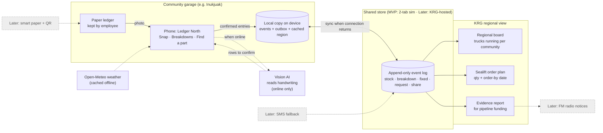

# Ledger North — Product & Build Spec

Hack for Humanity Ottawa 2026 · Challenge: Water in Canada's Northern Communities
Status: MVP build · Code freeze 3:30 PM · License: MIT

---

## 1. Problem

In Nunavik, water reaches homes by truck. When a truck or treatment-plant part fails, a community can go weeks with reduced or no water service. The spare part that would fix it may exist in another community, but:

- Parts records are **paper ledgers kept by individual employees**. They cannot be searched or seen by anyone else.
- **Communities do not currently share spare parts** with each other.
- Connectivity is **uneven**: some communities have fibre, others rely on satellite; outages and blizzards cut links when they matter most.
- Heavy parts arrive once a year by **sealift** (summer); anything else flies in on small planes. Parts not ordered before the sealift cut-off cause long waits.

Inukjuak's own documents name a chronic lack of drivers and outdated equipment; its mayor names three recurring causes of shortages: lack of drivers, lack of equipment, frozen pipes. Ledger North addresses equipment and frozen-pipe parts. It does not solve driver shortages.

**Problem statement:** Spare parts for Nunavik water systems are tracked on paper that cannot be searched, shared, or planned from, so one broken part can leave a community without water for weeks.

## 2. Solution and USP

**Ledger North reads the paper ledger instead of replacing it, shares stock between communities even without internet, and tells each community what to order before the sealift leaves.**

1. **Paper in, no new habits.** Staff keep writing in their ledger; a photo becomes checked digital entries.
2. **Offline-first.** Every device works with no connection and syncs when one is available. Entries are append-only, like the paper ledger, so merges never conflict.
3. **Opt-in regional sharing.** Each community chooses whether others can see its stock.
4. **Sealift-aware planning.** Order quantities and order-by dates follow the real shipping calendar.
5. **Evidence for funding.** Breakdown logs roll up into a report that supports Inukjuak's pipeline priority (Resolution #2025-29).

## Architecture



## 3. Users

| Role | Device | Main jobs |
|---|---|---|
| Garage / parts employee (ledger keeper) | Phone | Photograph ledger pages, confirm rows, log parts used |
| Municipal manager | Phone or laptop | Log breakdowns, find parts, request transfers, export report |
| KRG regional public works | Laptop | See all communities, approve transfers, plan sealift |

Households are not direct users in the MVP.

## 4. Scope

### Scope decision (Sept 26, pitch focus)
Pitch = (1) digitize the inventory ledger, (2) centralize the ledgers. The app has three tabs: **Dashboard** (one community's ledger: in stock / missing / running low; regional view adds all ledgers), **Snap ledger**, **Find a part** (ranked by estimated arrival by air). A Guide page is linked from the footer. F4 breakdown logging, F6 sealift plan and F7 report are removed from the UI (in git history) and move to the roadmap.

### In the MVP (must work in the demo)
- F1 Regional board
- F2 Snap ledger → confirm → save
- F3 Offline mode with outbox and sync
- F4 Breakdown log
- F5 Find a part + transfer request + approve
- F6 Sealift order plan
- F7 Evidence report
- F8 English / French UI; Inuktitut slot marked "with community review"

### Later (roadmap slide only)
- Real multi-device sync hosted in Nunavik (KRG servers)
- SMS fallback for single entries
- "Smart paper" ledger sheets (pre-printed part codes + QR page ID) for reliable offline reading
- FM radio announcement generator for shortages
- Snow-removal and road fleet after the pipeline (post-2030)
- Household water-status card

## 5. Features and acceptance criteria

### F1 Regional board
- Shows every community: water trucks running / total, drawn as blocks; status text **Normal / Reduced / Critical** (not colour alone). Critical when running ≤ 50%.
- The device's own community is pinned first and outlined.
- Shows whether each community shares stock.
- Offline: shows "as of your last sync, X ago".
- **Accept:** logging a water-truck breakdown in Inukjuak changes "4 of 6" to "3 of 6" and status to Critical.

### F2 Snap ledger
- Take or choose a photo (`capture="environment"`), preview it.
- "Read this page": if online and an AI key is set → vision model; if no key → demo reader returns fixed sample rows and **says so on screen**; if offline → "Photo saved; it will be read when you are back online".
- Confirmation table styled as ruled ledger paper: date, part (select from catalogue, fuzzy-matched), in, out, initials. Rows with confidence < 0.7 are highlighted and show the raw text read.
- "Save N entries" appends stock events with the writer's initials.
- Copy on screen: the paper ledger stays the employee's; the app keeps a copy for the municipality.
- **Accept:** saving 4 rows changes stock totals; the 4th (unclear) row is highlighted before saving.

### F3 Offline and sync
- Toggle in the top bar: Online / Offline. Also react to the browser `offline` event.
- Offline: new events go to the device outbox; badge shows "N waiting to sync".
- Back online: push outbox, pull everything new, show "Synced N entries".
- Other open views update live when the shared store changes.
- **Accept:** entries saved offline do not appear in the regional view until the device goes back online; then they appear without a page reload.

### F4 Breakdown log
- Choose equipment (water trucks 1..n, sewage trucks 1..n, intake pipe heater, chlorine pump) and part needed; log.
- List "Out of service now" with days down and "Mark fixed".
- **Accept:** logged breakdown appears on the board and in the report totals.

### F5 Find a part
- Pick a part. Show own stock with "updated X ago".
- Other communities sorted by distance: quantity + freshness if sharing; "Not shared" (quantity hidden) if not.
- "Request 1" creates a transfer request (queued if offline). Regional view or the lending community can Approve.
- 3-day weather at the requesting community (Open-Meteo): gusts, snowfall, risk label (High > 60 km/h gusts or > 10 cm snow; Some > 40 km/h or > 4 cm). Cached for offline with its age shown.
- **Accept:** Inukjuak requests a water pump from Puvirnituq; KRG view approves; status updates in both views.

### F6 Sealift plan
- Per community: part, expected use per year (6 winter months × winter rate + 6 summer months × summer rate), in stock, order quantity = Poisson 95% quantile − stock (min 0), shipping note (sea only for heavy items).
- Header: order-by date (estimated May 22, 2027 from NEAS 2026 first-sailing packaging cut-off; labelled as estimate).
- **Accept:** table sorted by order quantity; values change when stock changes.

### F7 Evidence report
- Last 90 days for a community: breakdowns count (trucks vs plant), total equipment-days out of service, longest outage, still open, parts requested.
- Ends with a sentence linking to the pipeline priority; labelled sample data.
- Copy button.

### F8 Language
- EN and FR for navigation, headings, status bar. Inuktitut option visible but disabled until phrases are written and reviewed by speakers. **Never machine-translate Inuktitut.**

## 6. Data model (append-only events)

All state is derived from a list of events. Events are never edited or deleted (except request status, see note).

```json
{ "id": "uuid", "type": "stock|breakdown|fixed|request|share",
  "community": "Inukjuak", "ts": 1790000000000, "by": "JK via ledger photo" }
```

| type | extra fields | meaning |
|---|---|---|
| stock | part, delta (+in / −out), reason (count / ledger page / transfer) | stock change |
| breakdown | asset, part | equipment out of service |
| fixed | ref (breakdown id) | back in service |
| request | from, to, part, status? | transfer request |
| share | on (bool) | community opts in/out of sharing |

Derived:
- Stock(c, p) = Σ delta; freshness = latest ts for (c, p).
- Trucks running(c) = total − open water-truck breakdowns.
- Sharing(c) = default map, overridden by latest share event.

Note: in the MVP, request approval updates the request's `status` in place. Cleaner later: an `approve` event with `ref`.

Static data: 8 Nunavik communities (name, approx. lat/lon, truck counts — Inukjuak 6 water, Puvirnituq 5 water from news reports; others sample), 10 parts, usage rates per community/part (sample), seed inventory and seed breakdowns (Inukjuak starts at 4 of 6).

## 7. Sync design

- **Demo (decided):** two-tab simulation. A shared `localStorage` key acts as the "server"; each device has its own key holding `online`, `outbox`, `cache`, `lastSync`. Two tabs (`?as=Inukjuak`, `?as=region`) simulate two devices; the `storage` event gives live updates. Said openly in the pitch.
- Isolate all storage behind one module (`src/store/`) with the interface `getEvents()`, `addEvent(e)`, `setOnline(bool)`, `subscribe(fn)`, so a real backend can replace it later without touching UI.
- **Production:** hosted in Nunavik (KRG), community-scoped access; only text entries sync on weak links; photos upload later.

## 8. AI reading

- Provider for demo: Gemini API free tier via REST from the browser; key stored only in the device's localStorage, **never committed**.
- Only photograph **sample pages written by the team**. Free tiers may use content to improve products.
- Prompt (returns JSON array): date, part, qty_in, qty_out, initials, confidence, raw_text; unclear values → confidence < 0.7; never invent rows.
- Human confirmation is mandatory before saving.
- Production: no-training paid tier or open model hosted by KRG.

## 9. Data ownership

- Each community owns its data and decides what it shares (default for new communities: not shared).
- The employee's paper ledger remains theirs; entries credit the writer.
- Aligns with ITK's National Inuit Strategy on Research priority on Inuit access, ownership and control of data.
- Full export available (roadmap).

## 10. Accessibility (must be evidenced)

- Atkinson Hyperlegible font (designed for low vision), base 18 px.
- Touch targets ≥ 44–48 px (gloves).
- Status never by colour alone (icons + words; striped blocks for out of service).
- Visible keyboard focus, skip link, labelled inputs, `aria-live` for sync and toasts, `lang` attribute follows language.
- `prefers-reduced-motion` respected.
- Run Lighthouse accessibility on the deployed page; screenshot the score for the pitch.

## 11. Tech stack and repo (decided: React + Vite rebuild)

- React 18 + Vite, plain CSS (one `styles.css` with design tokens), no UI library, no router (a `view` state + URL hash).
- The existing `index.html` prototype is the **reference implementation and fallback**: keep it deployed at `/prototype/` until the React build passes the §15 checklist.
- Deploy: GitHub Pages via GitHub Actions (`vite build`, `base: '/<repo-name>/'` in `vite.config.js`).
- External calls: Google Fonts, Open-Meteo, Gemini REST (all $0).

```
/index.html                 Vite entry
/vite.config.js             base path for GitHub Pages
/src/main.jsx
/src/App.jsx                top bar, tabs, view switch, language
/src/styles.css             tokens + components (port from prototype)
/src/i18n.js                EN/FR strings; IU disabled
/src/data/seed.js           communities, parts, rates, seed inventory, seed breakdowns
/src/store/store.js         event log, outbox, online flag, sync, subscribe (localStorage + storage event)
/src/store/derive.js        stock, openBreakdowns, sharing, trucksRunning, km, ago, poissonQ
/src/ai/readLedger.js       Gemini call + demo reader + part matching
/src/weather.js             Open-Meteo fetch + cache
/src/views/Board.jsx  Snap.jsx  Find.jsx  Breakdowns.jsx  Plan.jsx  Report.jsx
/public/prototype/index.html  original prototype (fallback)
/.github/workflows/deploy.yml
/SPEC.md  /CLAUDE.md  /README.md  /LICENSE (MIT)
```

## 12. Hackathon constraints

- Teams 1–4, start from zero, spend $0, public repo MIT/Apache, working public link.
- Submission by 3:30 PM: team, 250-char description, three 700-char answers, prototype link.
- Finalists: 3-minute pitch + 2-minute Q&A.
- Judging: social impact, technology, polish & accessibility, innovation (25% each).

## 13. Demo script (3 min, ordered by priority)

Priority for demo time: 1) ledger photo to entries, 2) offline then sync, 3) find a part in another community, 4) sealift plan and report.

| Time | Step |
|---|---|
| 0:00–0:20 | Hook: a broken heater froze Inukjuak's main pipe for nearly four weeks; only 3 of its usual 6 trucks were running. The part may sit in the next village, in a paper ledger no one can search. |
| 0:20–0:30 | USP one-liner. |
| 0:30–1:15 | **Photo to entries.** Hold up the handwritten page, photograph it, rows appear, the messy 4th row is highlighted with what the AI read; correct it. |
| 1:15–1:45 | **Offline then sync.** Tap Offline ("blizzard"), Save → "4 waiting to sync"; regional tab unchanged. Tap Online → "Synced 4 entries", regional tab updates live. |
| 1:45–2:25 | **Find a part.** Log Truck 4 water pump → board shows 3 of 6, Critical. Find a part → Puvirnituq has one, 181 km, confirmed X days ago, weather → Request → approve in regional tab. |
| 2:25–2:45 | Sealift plan and report, 10 seconds each. |
| 2:45–3:00 | Close: works offline, paper in, community-owned data, $0 today. "Until the pipeline arrives, Ledger North keeps the trucks running." |

Handwritten page for the demo:

| Date | Part | In | Out | By |
|---|---|---|---|---|
| Sept 24 | Tank heater element | 4 | | JK |
| Sept 25 | Hydraulic hose kit | | 1 | MA |
| Sept 25 | Water pump | | 1 | MA |
| Sept 26 | Filter cartridges (messy) | 6 | | JK |

## 14. Build plan for Claude Code (each step ends deployed and working)

Time-box strictly. If a step overruns, stop and demo with the prototype fallback.

1. **Scaffold + deploy (15 min):** Vite React app, GitHub Actions deploy to Pages, prototype copied to `public/prototype/`. Verify both URLs load.
2. **Store + seed + derive (20 min):** port data and logic from the prototype into `src/data`, `src/store`, `src/ai`, `src/weather.js` as plain JS modules. Unit-check in the console: Inukjuak 4 of 6 after reset.
3. **Priority 1 – Snap view (25 min):** photo, preview, read (Gemini / demo reader / offline message), confirmation table with highlighted unsure rows, save.
4. **Priority 2 – Offline + sync UI (15 min):** top bar toggle, outbox badge, toasts, live update in second tab.
5. **Priority 3 – Board, Breakdowns, Find (25 min):** truck blocks, status text, request/approve, weather.
6. **Priority 4 – Plan, Report, FR strings (15 min).**
7. **Accessibility + polish (10 min):** Lighthouse ≥ 95, 375 px layout, focus, labels.
8. **Freeze at 3:10:** final deploy, reset data, backup video, submit by 3:20. Submit the React URL only if §15 passes; otherwise submit `/prototype/`.

## 15. Test checklist

- [ ] Public link loads on a fresh phone
- [ ] Board shows Inukjuak 4 of 6 after reset
- [ ] Breakdown → 3 of 6 Critical, visible in second tab
- [ ] Demo reader: 4 rows, 4th highlighted
- [ ] Offline save → outbox 4 → online → synced, second tab updates
- [ ] Request → approve → status in both tabs
- [ ] Weather loads online; offline shows saved forecast age
- [ ] Sealift and report render for Inukjuak and a second community
- [ ] FR language switch works; no layout breaks
- [ ] Keyboard-only walkthrough possible
- [ ] No API key in the repo

## 16. Assumptions and open questions

| # | Question | Current assumption |
|---|---|---|
| 1 | Ledger columns | date, part, in, out, initials |
| 2 | Who approves transfers / who pays | municipal managers of both communities; KRG reimburses |
| 3 | Who places sealift orders | each municipality with KRG |
| 4 | Garage device | a phone |
| 5 | Ledger language | English, some French/Inuktitut notes |
| 6 | Truck counts outside Inukjuak/Puvirnituq | sample values |
| 7 | Weather thresholds for flights | 60 km/h gusts / 10 cm snow = high; to be set by local staff |
